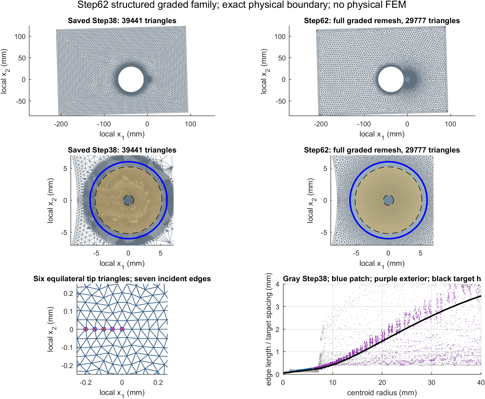
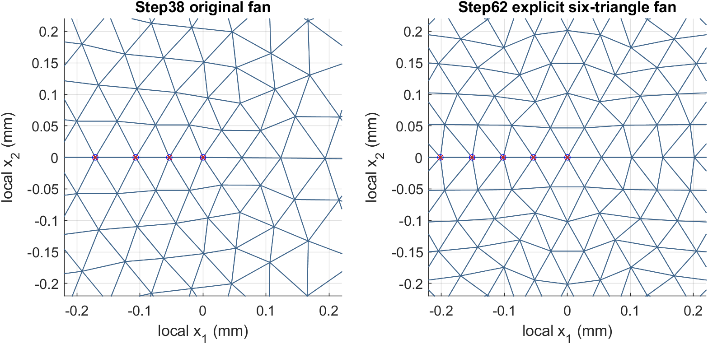

# Step62 — structured, smoothly graded asymmetric mesh family

The base member passes all geometry gates and the prescribed affine,
pure-I, pure-II and tiny-mixed qualification. It replaces every Step38 T3
triangle, including the exterior, while retaining the exact saved physical
polygon and all its original vertices. No physical displacement was loaded,
no stiffness was assembled, and no physical FEM solve was run.

Branch: `audit/step62-structured-graded-mesh`, based on
`audit/2026-10-04-results` at `04385732c5717e962547e3d6e280a66f15bb0d50`.
No merge is part of this step. `main` is unchanged.

## Inputs and scope

The design uses the Step56–61 findings, Step60 support convention, the
dated mesh audit and scientific review, and the existing production EDI,
native COD, T3-to-T6 and exact Williams helpers. The user explicitly selected
full exterior remeshing with exact physical boundary geometry preserved.
Step61 audit conventions are reused; its candidate coordinates, cavity,
irregular refinement pattern and 13-edge fan are not reused.

`verification/step38_tip_refined_solved.mat` is investigator-local and is
loaded selectively for `mesh`, `crack`, `baseline`, `actualTip`, `a0`, `mat`.
Its SHA-256 is
`ffe5384c05074b3c8d5ec847845216b17d95b454d5f8f6b4df7a17f848507f98`.
The stored mesh supplies the physical polygon, its subdivisions and the
crack endpoints; no nominal plate or hole reconstruction is used.

| Saved quantity | Value |
| --- | ---: |
| Crack length | 8 mm |
| Mouth, global metres | `[0.199988872196, -0.0208170339049]` |
| Tip, global metres | `[0.207985904782, -0.0210349096129]` |
| Stored measured tip scale | 0.0540246507854 mm |
| Primary EDI inner / outer radius | 0.8 / 5.2 mm |
| Step60 maximum support-node radius | 5.379192 mm |
| New paired radius | 6 mm |
| Nearest noncrack physical boundary | 8 mm |

The paired polygon has 174 outer segments at level zero. Its inscribed
radius exceeds the complete old and new T6 support extent. The support
audit checks actual FE-nodal-q participation, including the literal
production loop's roundoff gradients in elements with constant nodal q.

## Structured topology and size law

`build_step62_structured_patch.m` constructs the connectivity explicitly.
There is no Delaunay triangulation, relaxation or nested refinement inside
the paired region. Three upper 60-degree sectors start with three
equilateral fan triangles. Their reflection produces six tip triangles and
seven incident topological edges: the negative-axis crack edge has separate
upper/lower IDs, while the positive-axis ligament has shared IDs.

For family level `L`, define `lambda = 2^(-L)` and

```text
h(r) = lambda * (hTip + 0.028*r),       0 <= r <= 6 mm
first ring radius = lambda*hTip
```

`h` denotes target point/arc spacing, rather than the longest triangle edge.
Ring radii have equal increments in the metric integral `integral dr/h`.
The number of bands is rounded upward and the metric step is redistributed
so the outer ring lands exactly at 6 mm without a short terminal band.
Band widths increase strictly. At level zero there are 59 rings; the
successive annular widths grow by a factor 1.02417964. The first annular
width is 0.047960 mm and the last is 0.187204 mm.

Each upper ring has `3*ceil(pi*r/(3*h(r)))` angular intervals (the first
ring has three). Multiples of three keep all sector boundaries aligned;
angular counts increase by at most three per ring in the tested members.
Each pair of adjacent sector arcs is joined by an ordered zipper, choosing
the shorter new bridge with a fixed parity tie break. The upper coordinates
and connectivity are reflected exactly and lower orientation is reversed.
Negative-axis nodes are duplicated, including T6 crack midsides; positive
axis and tip IDs are shared. T6 conversion uses unchanged `T3toT6_fast`.

The parameters and topology were chosen from geometry and spacing checks
before applying prescribed Williams fields. No parameter was fitted to
Step38's solved SIF values, and no physical SIF value is an input.

## Fully remeshed asymmetric exterior

`build_step62_graded_exterior.m` uses constrained Delaunay triangulation
outside the structured polygon. Radial seed rings continue from 6 mm.
For `t = max(0,r-6 mm)`, `ell = 8 mm`, and
`c = lambda*5 mm - h(6 mm)`, its C1 continuation is

```text
increment = lambda * (0.028*t + (0.15-0.028)*ell*log(cosh(t/ell)))
hExterior = h(6 mm) + c*tanh(increment/c)
```

The size and first derivative match the patch law at 6 mm and the spacing
increases smoothly toward a `lambda*5 mm` far-field cap. Radial increments
are `sqrt(3)/2*hExterior`; angular counts are multiples of six. Exact saved
boundary segments and the exterior crack are constraints. The straight
crack segment from the saved mouth to the patch is resampled uniformly,
avoiding an accidental short inherited face edge at the seam.

Dense physical-boundary subdivisions require a second spacing constraint.
The effective target is the minimum of the radial law and the continuous
boundary envelope

```text
lambda * min_j(1.2*length(savedSegment_j) + 0.30*distanceToSegment_j)
```

Initial inward layer seeds use saved segment normals and original adjacent
triangle orientation. Six bounded smoothing attempts move only interior
seeds. Deterministic constrained-Delaunay quality refinement then inserts
spaced circumcenters or splits encroached exterior constraints. The
structured inner edges remain protected. The refinement target is 25
degrees and longest edge <= 1.65 times the local effective spacing. Original
physical vertices never move; added boundary vertices subdivide the saved
straight polygon segments. Base generation required five insertion passes
and eight physical-boundary subdivisions, followed by a clean sixth check.

The geometry audit checks interval coverage of every original segment,
with no added off-polygon segment, missing interval or overlapping interval
(1e-12 m line tolerance, 1e-9 fractional interval tolerance). All 736 saved
physical boundary node IDs, including distinct coincident mouth IDs,
retain their global coordinates bitwise. This preserves the boundary
geometry and corner anchor coordinates. It does not replace the saved hole
polygon by a nominal curve. All 39,441 original triangles are replaced.

## Base mesh measurements

| Quantity | Step38 | Step62 level 0 |
| --- | ---: | ---: |
| T3 nodes | 20,164 | 15,329 |
| T3 triangles | 39,441 | 29,777 |
| T6 nodes | 79,769 | 60,435 |
| Primary support, Step60 convention | 14,215 | 10,278 |
| Literal production EDI participating elements | 15,053 | 11,316 |
| Incident tip edges | 7 | 7 |
| Minimum whole-mesh angle | 3.6014 degrees | 25.0358 degrees |

The new mesh has 12,678 paired triangles and 17,099 exterior triangles.
It reduces T3 count by 24.50% and T6 node count by 24.24%. The paired region
has minimum angle 40.653846 degrees and minimum normalized shape quality
0.826625. Whole-mesh maximum adjacent longest-edge ratio is 2.31102,
passing the predeclared 2.5 gate. Exact pairing residuals after rotation
to global coordinates are 2.7330e-17 m for T3 and 5.1204e-17 m for T6.
The minimum 16-point T6 Jacobian is 2.4456e-9 m².

Positive areas/Jacobians, shared seam edges, valid edge incidence, no
duplicate triangles, no unused vertices, domain-area agreement and
physical-boundary coverage pass. Both support definitions lie wholly in
the paired region; no exterior element participates in primary EDI.
Native COD windows `[.04,.20]`, `[.04,.30]`, `[.08,.30]`, `[.12,.30]`
in `r/a0` contain 38, 55, 44 and 34 points respectively. Crack side IDs
and midpoint topology remain distinct, with matching abscissae.

Smooth monotone target spacing and radial band widths do not imply that
every actual edge increases along every radial ray. Angular integer
changes, triangle diagonals and saved physical-boundary density introduce
bounded edge variation. Actual radial and quality distributions are saved,
and the adjacent-size gate assesses the resulting mesh directly.





## Prescribed-field qualification, level zero

Extraction uses the unchanged production `SIF_LEFM_interaction_EDI`, the
fixed 0.8–5.2 mm annulus, `WeightFunction='fe_nodal'` and 16-point quadrature.
Exact Williams nodal displacements use the topologically labelled crack
faces. The inputs are independent unit modes and a tiny mixed mode,
not the solved Step38 field. All gates pass.

| Prescribed `(KI,KII)` | Recovered KI | Recovered KII |
| --- | ---: | ---: |
| `(1,0)` | 1.00000006621 | 9.05395e-15 |
| `(0,1)` | 2.10975e-15 | 1.00000003838 |
| `(1,1e-4)` | 1.00000006621 | 0.000100000003847 |

Affine values and gradients are checked at all 16 quadrature points in
every element; the maximum residual is 8.7311e-11. The recovery-matrix
Frobenius error is 7.6533e-8, tiny-mixed relative KII error is 3.8470e-8,
and superposition residual is 1.2213e-14. Gates are affine <=1e-8,
pure-mode cross leakage <=1e-10, matrix/mixed relative error <=2e-4, and
superposition <=1e-10. A saved-candidate reload independently reconstructs
the T6 mesh and verifies complete support-node containment without a
physical field.
The reload also verifies each builder/driver SHA-256 against the saved
provenance. Maximum participating T6-node radius is 5.277284 mm in the base
member and 5.270472 mm in level one, both inside the paired polygon.

These controls qualify interpolation and extraction on prescribed fields.
They are not physical error bars or evidence that the future physical
Step38 KII converges, vanishes or has any particular sign.

## Family qualification and reproduction

The patch invariants are tested at levels zero and one: bitwise repeated
generation, six-triangle/seven-edge fan, halved tip scale, increasing band
widths, bounded angular increments, reflected connectivity, exact polygon
area coverage, positive triangles and edge incidence. Complete remeshing
at level one also passes all structural gates and repeated construction.

| Quantity | Level 0 | Level 1 |
| --- | ---: | ---: |
| Scale | 1 | 1/2 |
| Patch rings | 59 | 117 |
| Patch T3 | 12,678 | 49,518 |
| Whole T3 | 29,777 | 110,692 |
| Whole T6 nodes | 60,435 | 222,652 |
| Tip edge, mm | 0.05402465 | 0.02701233 |
| Whole minimum angle, degrees | 25.0358 | 25.4247 |
| Maximum adjacent edge-size ratio | 2.31102 | 2.00899 |
| Physical boundary subdivisions | 8 | 261 |

The members share a controlled size law and topology rules but are not
nested meshes. Boundary envelopes, radial law and far cap scale together.
Levels 2–4 are supported by the implementation but have not been qualified
here. Level-one prescribed-field controls and all physical convergence
studies remain future work; its accepted candidate is marked geometry-only.

In MATLAB R2023a, on the Step62 branch with the investigator-local saved
checkpoint available:

```matlab
addpath(genpath(pwd));
family = test_step62_structured_family();
O62 = main_step62_structured_graded_mesh();
O62fine = main_step62_structured_graded_mesh('Level',1,'RunSynthetic',false);
baseAudit = test_step62_saved_candidate();
fineAudit = test_step62_saved_candidate( ...
    'verification/step62_structured_graded_mesh_L1_candidate_T3.mat');
```

Default output prefix is `verification/step62_structured_graded_mesh`;
level one appends `_L1`. Each candidate MAT contains the exact T3 mesh,
crack/material metadata, reflection map, original-to-candidate node map,
ring designs, support IDs, gates and source hashes. T6 is reconstructed by
`T3toT6_fast`; no physical U, force or stiffness is stored. CSV files provide
summary, quality, radial, native sampling, tip edge, ring, exterior ring,
refinement and synthetic tables. Small-data MAT files retain audit scalars.
The manifest records SHA-256 hashes for the Step62 sources and results.
Run logs retain the base controls, finer geometry checks and saved-candidate
integrity checks. The saved checkpoint containing physical U is excluded
from both the committed Step62 results and the deliverable bundle.

Bitwise determinism was verified by repeating full construction in the same
MATLAB R2023a environment. Cross-version Delaunay reproducibility is not
claimed; the accepted exact candidate coordinates/connectivity are saved.
The implementation reuses the saved polygon for domain-membership tests,
and does not infer or change physical boundary conditions or loads.

The base candidate is qualified for consideration in a separate, explicitly
authorized physical convergence task. This step performs no physical solve
and makes no merge.
